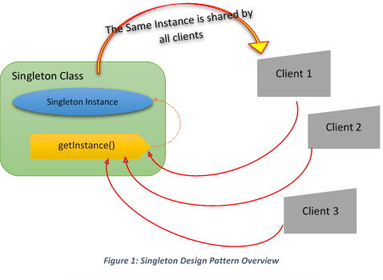
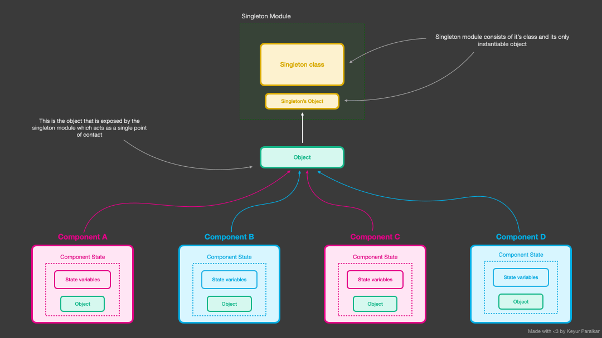
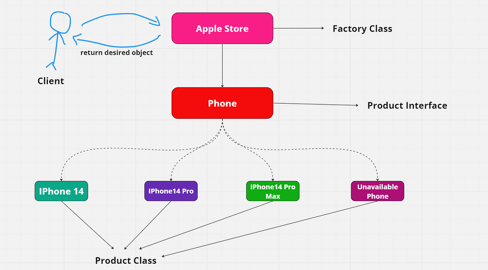
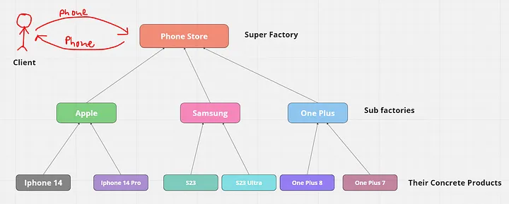

# Design Pattern

<details>
<summary>Index</summary>

## Index

- Introduction
- Creational Patterns
</details>

---

<details>
<summary>Introduction</summary>

## Introduction

- The best practices followed by experienced software developers are called design patterns.
- Design Patterns represent the best practices used by experienced object-oriented software developers.
- Design Patterns are solutions to general problems that software developers faced during software development.
- These solutions were discovered through trial and error by many software developers over a long period of time.
- Design patterns acts as templates for real world problems.
- Using design patterns makes your code cleaner, easier to maintain, and more flexible.

### Types of Design Patterns

1. Creational Patterns -> Object Creation & Initialization
2. Structural Patterns
3. Behavioral Patterns -> Communication between classes & Objects

#### Creational Pattern

- These design patterns provide a way to create objects that increase flexibility and reuse of existing code.
- Reduce the complexity of object creation.
- Examples: Singleton, Factory, Abstract Factory, Builder, Prototype.
- Define the best possible way to reuse it.

#### Structural Pattern

- These design patterns concern class and object composition. Concept of inheritance is used to compose interfaces and define ways to compose objects to obtain new functionalities.

- Structural patterns concentrate on assembling objects and classes into larger structures while maintaining flexibility and efficiency.

#### Behavioral Patterns

- These design patterns are specially concerned with communication between objects.

</details>

---

<details>
<summary>Creational Patterns</summary>

## Creational Patterns

1. Singleton
2. Factory
3. Abstract Factory
4. Builder
5. Prototype

### Singleton

- The Singleton pattern ensures that only one instance of a class is created throughout the program. This instance is globally accessible.
- It facilitates the creation of a single instance that can be shared across multiple components.




```js
class Singleton {
	constructor() {
		if (Singleton.instance) {
			return Singleton.instance;
		}
		this.data = []; // This is Global store
		Singleton.instance = this;
	}

	// Static method ensures getInstance can be called without an instance.
	static getInstance() {
		return Singleton.instance || new Singleton();
	}

	addData(item) {
		this.data.push(item);
	}

	getData() {
		return this.data;
	}
}

// Usage
const instance1 = Singleton.getInstance();
instance1.addData("Data 1");

const instance2 = Singleton.getInstance();
instance2.addData("Data 2");

console.log(instance1.getData()); // Output: ['Data 1', 'Data 2']
console.log(instance2.getData()); // Output: ['Data 1', 'Data 2']
```

### Factory

- In Factory pattern, we create objects without exposing the creation logic to the client and refer to newly created object using a common interface.

- A Factory Pattern says that just define an interface for creating an object but let the subclasses decide which class to instantiate. In other words, subclasses are responsible to create the instance of the class.
- Factory Method Pattern allows the sub-classes to choose the type of objects to create.




### Example :

We can think of the Factory Pattern like a car manufacturing plant. Instead of customers deciding which car to build, they provide specifications to the factory, and the factory decides which car to produce. For example, a sports car factory would produce sports cars, while a sedan factory would produce sedans.

### steps

1. create an interface. **Product**
2. create concrete classes implementing the same interface. **Book**, **Shirt**
3. create a Factory to generate object of concrete class based on given information. **ProductFactory**

```js
// All products produced by One Factory
class Shape {
	draw() {}
}

class Circle extends Shape {
	draw() {
		console.log("Drawing Circle");
	}
}

class Rectangle extends Shape {
	draw() {
		console.log("Drawing Rectangle");
	}
}

class ShapeFactory {
	createShape(type) {
		switch (type) {
			case "circle":
				return new Circle();
			case "rectangle":
				return new Rectangle();
			default:
				throw new Error("Invalid shape type");
		}
	}
}

// Usage
const factory = new ShapeFactory();
const shape1 = factory.createShape("circle");
shape1.draw();

const shape2 = factory.createShape("rectangle");
shape2.draw();
```

### Abstract Factory

- The Abstract Factory Pattern extends the Factory Pattern by introducing a 'super-factory' responsible for creating families of related or dependent objects without specifying their concrete classes. This pattern ensures that objects created by the factory are compatible with each other.

- Abstract Factory patterns involve a central factory, known as a super-factory, which creates other factories. This super-factory is also called a "factory of factories."

- In Abstract Factory pattern, an interface is responsible for creating a factory of related objects without explicitly specifying their classes. Each generated factory can give the objects as per the factory pattern.

- The "factory" object has the responsibility for providing creation services for the entire platform family. Clients never create platform objects directly, they ask the factory to do that for them.
- The purpose of the Abstract Factory is to provide an interface for creating families of related objects, without specifying concrete classes.



### Steps

1. Create an interface. **Shape**
2. Create concrete classes implementing the same interface. **Rectangle**, **Square**, **Circle**
3. Create an interface for colors. **Color**
4. Create concrete classes implementing the same interface. **Red**, **Green**, **Blue**
5. Create an Abstract class to get factories for Color and Shape objects. **AbstractFactory**
6. Create Factory classes extending Abstractfactory to generate object of concrete class based on given information. **ShapeFactory**, **ColorFactory**
7. Create a Factory generator/Producer class to get factories by passing an information such as Shape or Color. **FactoryProducer**

### Example

Imagine an Abstract Factory as a central factory that knows how to create other factories. Each of these sub-factories specializes in creating a specific family of related products. For instance, you might have a factory for creating different shapes and another for creating different colors. Each factory ensures that the shapes and colors it produces are compatible with each other.

```js
// Every Product has own Factory
class Shape {
	draw() {}
}

class Circle extends Shape {
	draw() {
		console.log("Drawing Circle");
	}
}

class Square extends Shape {
	draw() {
		console.log("Drawing Square");
	}
}

class ShapeFactory {
	createCircle() {}
	createSquare() {}
}

class CircleFactory extends ShapeFactory {
	createCircle() {
		return new Circle();
	}
}

class SquareFactory extends ShapeFactory {
	createSquare() {
		return new Square();
	}
}

// Usage
const circleFactory = new CircleFactory();
const circle = circleFactory.createCircle();
circle.draw();

const squareFactory = new SquareFactory();
const square = squareFactory.createSquare();
square.draw();
```

</details>

---
